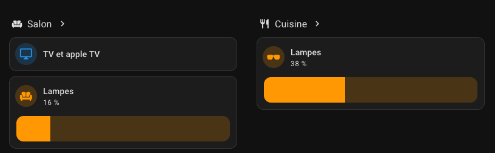

+++
date = '2025-01-20T15:38:07+01:00'
draft = false
title = 'Éclairage'
categories = ['Domotique']
description = "Un tour des solutions pour rendre votre éclairage intelligent, bien fait et pas trop cher."
+++

Si vous voulez commencer à rendre votre maison intelligente, l'éclairage connecté est un *must* :

- C'est un des éléments les plus simples à mettre en place : vous n'avez généralement besoin que d'une prise, d'un peu de place, et de moins d'une centaine d'euros par pièce.
- C'est aussi un élément très utile : vous allumez automatiquement les lumières en arrivant, ou si vous entrez dans votre cuisine avec les mains pleines.

> [!IMPORTANT]
> **En bref :** installez et utilisez des rubans de led de qualité, c'est beau, c'est lumineux, c'est pas cher, facile à installer, et ça se contrôle avec Homeassistant.
> 
> Pour l'existant, partez sur des micro-modules 433 mHz + WiFi, et des interrupteurs 433 mHz.

## Rapide tour des possibles

> [!TIP]
> Pour aller plus vite, faites-moi confiance et passez directement à la partie [mes recommandations]().

### Ampoules connectées


  


Les ampoules connectées sont une bonne façon de débuter, mais elles souffrent malheureusement de plusieurs inconvénients majeurs : 

- Elles sont chères : comptez une vingtaine d'euros par ampoule.
- Elles ne sont pas (forcément) compatibles avec vos interrupteurs existants.
- Elles n'éclairent que très peu : vous aurez besoin de beaucoup d'ampoules pour couvrir votre maison.
- D'un point de vue sécurité, avez-vous vraiment envie de jeter votre mot de passe wifi dans les poubelles communes quand l'ampoule tombe en panne ?
- Elles sont parfois dépendantes d'une gateway à acheter en sus.

### Prises connectées

Les prises connectées sont une alternative intéressante : elles sont moins chères, plus simples à installer, et vous pouvez y brancher n'importe quel appareil électrique.
Elles sont généralement compatibles WiFi ou Zigbee (et permettent donc d'étendre votre réseau Zigbee à moindre frais).

Dans Homeassistant, vous pouvez transformer une prise connectée en "lumière" très simplement [depuis l'interface utilisateur](https://www.home-assistant.io/integrations/switch_as_x/).

### Interrupteurs connectés

Attention, il existe deux types de combo interrupteurs/micro-modules

- Les interrupteurs vendus dans les magasins de bricolage, controllables radio (généralement 433 mHz) : je vous les déconseille : la communication radio n'est pas fiable du tout.
  - Quand vous voulez commander plusieurs lumières avec un seul interrupteur, certaines s'allument, d'autres ne reçoivent pas le signal et restent éteintes. 
    Si vous rappuyez sur le bouton, vous risquez d'allumer certaines lampes et d'en éteindre d'autres : un cauchemar.
  - Vous ne pouvez pas les commander via des automatisations avec Homeassistant sans acheter d'émetteur/récepteur 433 mHz, et sans décoder le protocole radio.
  - Même quand un interrupteur commande une seule et unique lampe, la transmission peut mettre quelques secondes, ce qui donne un délai quand on appuie sur l'interrupetur. 
    Si l'on rappuie, la lumière s'éteint à nouveau, c'est frustrant !
- Les interrupteurs compatibles WiFi et 433 mHz. Ils ne sont généralement pas plus chers que ceux que l'on trouve en magasin, 
  mais présentent de nombreux avantages :
  - Vous pouvez contrôler les lumières à distance via Homeassistant
  - Votre serveur Homeassistant s'assure de synchroniser vos lumières si jamais certaines ne captent pas le signal 433 mHz.
  - Si votre serveur tombe en panne, vous pouvez toujours allumer vos lumières avec l'interrupteur. Pratique !

### Les rubans de LED connectés

La encore, les rubans "tout faits" que vous pouvez trouver sur Amazon ou Aliexpress sont un achat risqué : 
la qualité n'est pas toujours au RDV, et vous ne savez pas comment ils pourront (ou non) s'intégrer dans votre installation domotique.

Cependant, il existe de **très bons rubans de LED** que je vous conseille [plus loin dans ce récap]().

## Mes recommandations

Il faut prendre en compte l'existant : toute maison dispose généralement de plafonniers. 
Il faut donc utiliser un système type micro-module pour les contrôler. Dans le cas ou cela vous semble trop fragile 
(ça l'est !), contentez-vous simplement d'installer des luminaires supplémentaires.

Quand il s'agit d'ajouter de la lumière, les rubans de LED sont de loin la meilleure solution, mais attention, **pas n'importe lesquels**.

### Micro-modules pour contrôles les plafonniers existants

Commençons par un passage chez Aliexpress pour acheter ces micro-modules.
En France, nous avons rarement des "fils neutres" dans les interrupteurs, mais on peut les trouver (évidemment) dans les plafonniers.

Mon conseil pour **les lampes existantes** est le suivant :

- Achetez un micro-module par lampe, à placer sur le plafonnier, la ou les fils se connectent avec la lampe.
- Au niveau des interrupteurs, vous voulez des interrupteurs 433 mHz à pile : ils sont simples à installer. 
  Le nombre de "gang" sur aliexpress correspond simplement au nombre de contrôles séparés sur l'interrupteur. 
  Si vous avez un interrupteur bi-zone, choisissez deux gangs, sinon, un gang suffit.

En cherchant sur Aliexpress "interrupteur 433 mHz wifi", vous trouverez [ce genre d'interrupteurs](https://fr.aliexpress.com/item/1005007431562078.html).
Ils sont vendus en packs (N interrupteurs + M récepteurs), et sont compatibles Tuya (et donc Homeassistant, via l'intégration localtuya).

Le plastique de ces interrupteurs fait cheap, mais vous pouvez les fixer directement au mur, en remplaçant (ou non) votre interrupteur existant. 
Vous devrez bloquer les interrupteurs existants en position ON...

Attention à bien acheter :

- Compatible WiFi et radio 433 mHz
- Compatible Tuya
- Les piles si elles ne sont pas fournies 
  (il ne s'agit jamais de piles AA ou AAA, mais soit de piles boutons, soit de piles encores plus étranges... Mais trouvables sur Amazon)

#### Alternatives

Il existe des modules qui se greffent derrière vos interrupteurs existants, et qui permettent de controller de façon identique les micro-modules.
Cela vous permet d'utiliser des interrupteurs de meilleur qualité, mais cela requiert une boite de dérivation pas trop remplie et un peu de place derrière l'interrupteur.

Vous pouvez aussi vous renseigner auprès de Shelly, qui propose des modules de qualité, mais un peu plus chers. Je n'ai pas testé.

### Rubans de LED

Les rubans de LED sont pour moi le **meilleur moyen de commencer avec la domotique**, mais aussi de gérer un éclairage de qualité.

#### Les différent types de rubans

Il existe plusieurs types de rubans de LED, et il est important de bien les distinguer :

- Rubans RGB : ils permettent de changer la couleur de la lumière, mais ne sont pas très lumineux. Les leds sont généralement espacées, et la lumière n'est pas très homogène.
- Rubans RGBW : ils permettent de changer la couleur de la lumière, mais disposent aussi de leds blanches. Ils sont plus lumineux que les rubans RGB, et la lumière est plus homogène. Ca reste très moyen.
- Rubans RGBWW : ils permettent de changer la couleur de la lumière, mais disposent aussi de leds blanches chaudes et froides. Ils sont un peu plus lumineux, mais vous ne pouvez pas utiliser les leds RGB et WW en même temps. Ca reste médiocre.
- Rubans de couleur fixe : un seul type de led, généralement blanc chaud, froid ou naturel. Ce sont les rubans les plus lumineux.

Chaque type de ruban est vendu en différentes densités de LED par mètre, et sous différentes tensions. 

Ma recommandation est très simple. Ce qui est utile, c'est de pouvoir éclairer la pièce avec un seul ruban, 
que la lumière ne clignote pas, ne face pas mal aux yeux, soit naturelle, et que les leds individuelles ne 
soient pas visibles (c'est plus esthétique).


  
  
  


Il vous faut :

- Un ruban de couleur fixe, blanc chaud ou naturel (2700K à 4000K) : c'est le plus lumineux, et le plus agréable à l'oeil.
- Une densité de LED de **528 LED par mètre** : c'est la densité la plus élevée, et donc la plus lumineuse. Oui c'est beaucoup. Oui c'est bien. Trust me.
- Une tension de 24 V : la tension restera plus élevé et vous aurez moins de différence d'éclairage au bout du ruban.
- Une longueur de 10 mètres maximum par alimentation : au delà, vous aurez des pertes de tension trop fortes : il faudra rajouter une alimentation.
  - 10 mètres, c'est très lumineux, surtout à 528 leds par mètre. Les rubans que vous achetez sont découpables aux ciseaux.
  - Pour une petite pièce 5 mètres suffisent, mais je vous conseille quand même d'acheter 10 mètres et de prévoir deux rubans parallèles et côte-à-cote pour plus de luminosité de pic et moins d'usure des rubans.
- Pour contrôler la luminosité, un dimmer wifi (Tuya) 200W. Ils sont compatibles homeassistant.
- Et pour fournir le courant nécéssaire, une alimentation 24V. J'ai utilisé des alimentations 200W, sur-dimensionnées, ce qui évite une usure précoce. 
  - La plupart des fabricants recommandent de ne pas consommer 80% de la puissance maximale de l'alimentation.

En bref, cela veut dire :

- Acheter N rubans pour le linéaire total de ce que vous voulez couvrir. Les rubans de chez [BTF-LIGHTING en FCOB](https://www.amazon.fr/dp/B0BRV1PPVP) sont vraiment superbes.
  - Pensez à choisir la couleur : blanc chaud (3000 K) ou blanc naturel (4000 K). Je trouve le blanc froid plus désagréable.
    - Astuce pour le choix de couleur, elles sont exposées dans les magasins de bricolage. On se rends assez mal compte sur les photos internet.
    - Je suis parti avec des rubans 3000 K, et ils sont très bien, même pour travailler sur ordinateur. Pour du dessin, ce n'est probablement pas un bon choix.
  - Prenez bien la version 528 leds/mètre, c'est la plus lumineuse, et ça en vaut franchement le coup !
  - Il existe une version 5 mètres, mais je vous conseille de prendre plutot des 10 mètres, et de découper le ruban si besoin. Ils coûtent moins cher.
- Pour chaque emplacement que vous souhaitez controller, vous aurez besoin :
  - D'un dimmer wifi, tel que mentionné plus tôt. Ils sont [en vente sur AliExpress](https://fr.aliexpress.com/item/1005004996675789.html), et sont compatibles Tuya.
    - J'ai choisi les dimmers BTF-LIGHTING, pour m'assurer de leur bon fonctionnement avec les rubans. Ils sont probablement compatibles toutes marques, et il existe d'autres vendeurs.
    - Dans tous les cas, vous cherchez un dimmer 2-pins. Pas de RGB ou de RGBCCT.
  - D'un transformateur 24 V, aussi [sur AliExpress](https://fr.aliexpress.com/item/4001260747482.html?spm=a2g0o.order_list.order_list_main.11.1ca15e5bSHgnnP&gatewayAdapt=glo2fra).
    - Pour 10 mètres de ruban, partez pour du 200 W
    - Pour moins de ruban, vous pouvez faire le calcul de la tension minimum : le ruban BTF-LIGHTING consomme 14W/mètre, et il vous faut 20% de marge (mais la formule n'est peut-être pas aussi simple qu'elle en à l'air...).
      - Personnellement, je ne me suis pas soucié de différer les transformateurs : le wattage est la tension maximale délivrable, mais les rubans n'utilisent que ce dont ils ont besoin. 
      - La différence de prix ne vaut pas le stress de se tromper.

Si vous n'êtes pas équipés avec un materiel à tout faire électrique, je vous conseille aussi d'acheter :

- Un peu de fil "hifi" dans votre magasin de bricolage préféré (exemple chez [Leroy Merlin](https://www.leroymerlin.fr/produits/electricite-et-domotique/reseau-informatique-et-telephonie/cable-internet-telephonie-et-hi-fi/cable-enceinte-hifi-2x0-75mm2-10m-noir-et-rouge-lexman-82658710.html))
  - Il s'agit de simples fils rouges et noirs. Le rouge se connecte au "+" du dimmer/transformateur/ruban, le noir au "-".
- Un [fer à souder](https://pine64eu.com/product/pinecil-smart-mini-portable-soldering-iron/),
  - Celui en lien est USB-C et fonctionne avec un chargeur d'ordi, c'est très pratique. Il est un peu cher.
- Une [pince à dénuder 'moderne'/automatique](https://www.leroymerlin.fr/produits/outillage/outillage-a-main/pince-et-tenaille/pince-a-denuder/pince-a-denuder-multifonction-automatique-dexter-82887285.html) (pour éviter le cutter, c'est un must !) 
- Des Wagos ou des dominos pour relier les fils 220V entre eux.
- De la gaine thermo-rétractable pour protéger les soudures
- [Une pince à sertir 'aperture science'](https://fr.aliexpress.com/item/1005005262056353.html)
  - Il existe 50000 modèles de pinces à sertir, prenez en une pas trop chère.
  - Il vous faudra aussi des embouts de fils, généralement inclus quand vous achetez la pince, et qui vous dureront une éternité.
  - Ces embouts rentrent dans les Wagos si vous voulez quadrupler un ruban de led (4 rubans parallèles, c'est clairement trop, mais c'est possible !)
- Quelques vis pour fixer le transformateur. Le dimmer et le ruban sont autocollants.
  - Le scotch double-face marche aussi très bien. 
  - Si le transformateur est placé au-dessus d'un meuble, vous n'avez même pas besoin de le fixer.

L'installation physique est très simple ! Vous branchez le neutre, la phase et la terre au transformateur, puis vous reliez l'une des deux sorties du transformateur au dimmer. 
Le dimmer dispose de deux sorties, utilisez les deux si vous le placez au milieu du ruban, sinon utilisez en une. 
Je ne m'embête généralement pas à placer le dimmer + transformateur au milieu.

### Installation dans Homeassitant

L'intégration [LocalTuya](https://github.com/rospogrigio/localtuya) initiale n'est plus maintenue pour les nouvelles versions du protocole. 
Heureusement, quelqu'un maintient [un fork](https://github.com/xZetsubou/hass-localtuya) qui fonctionne très bien avec 
l'ensemble des appareils Tuya que j'ai pu tester, dont les interrupteurs.

Avec un dashboard Mushroom, vous obtenez une très belle interface de ce type :

Si vous avez plusieurs rubans dans une pièce, je recommande fortement d'installer [Lightener](https://github.com/fredck/lightener), qui permet de contrôler 
plusieurs rubans en même temps, et surtout d'avoir des courbes d'allumage différentes en fonction d'un seul slider.

## Aller plus loin

Si vous voulez des leds non pas pour éclairer, mais pour décorer, regardez du côté de [WLED](https://kno.wled.ge/), 
qui permet de contrôler des rubans de LED WS2812B (les rubans adressables) avec des effets de lumière très sympas.

Les rubans WS2812B dont moins lumineux, mais vous pouvez changer la couleur de chaque led individuellement, 
ce qui vous permet de faire des effets de type vague de couleur. 


