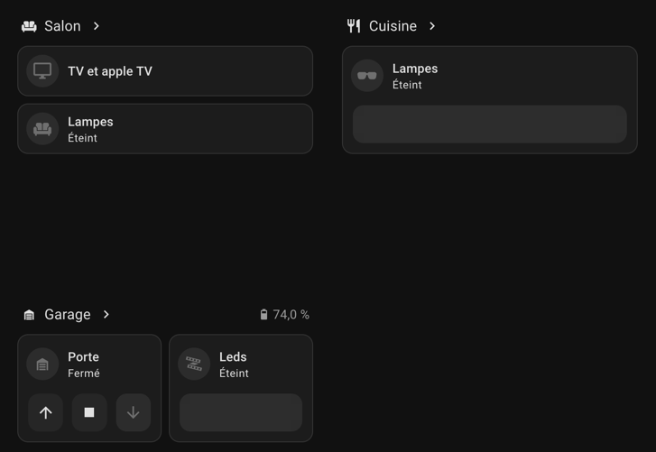

+++
date = '2025-01-21T00:00:00+01:00'
draft = false
title = 'Installer Home Assistant'
categories = ['Domotique']
description = "Installation et configuration de Home Assistant, le cerveau de votre maison connectée."

next = '/domotique/systemes/'
+++

Si vous voulez une maison vraiment intelligente, Home Assistant est incontournable :

- C'est la solution la plus complète du marché : compatible avec plus
  de [3000 technologies différentes](https://www.home-assistant.io/integrations/)
- C'est [open source](https://github.com/home-assistant/) : pas de risque que vos appareils arrêtent de fonctionner du
  jour au lendemain
- C'est gratuit et respectueux de votre vie privée : vos données restent chez vous, et ne partent pas dans le cloud
  d'une entreprise (Google, Apple, Amazon...)

> [!IMPORTANT]
> **En bref :** installez Home Assistant sur un serveur dédié (un beau Raspberry Pi, ou votre vieil ordinateur),
> connectez vos appareils, et profitez d'une maison vraiment intelligente.
>
> Comptez environ 100€ pour un Raspberry Pi tout équipé, ou utilisez un ordinateur que vous avez déjà.
>
> Si vous voulez économiser, comptez une petite journée pour tout installer et configurer.

## Pourquoi Home Assistant ?

> [!TIP] Tl;Dr
> Home Assistant est le plus complet, le plus stable, et le plus respectueux de votre vie privée. Il fonctionne avec
> tout.
>
> L'installation est simple, décrite dans de nombreux guides, et ne nécessite pas de compétences techniques
> particulières. [^1]

### Une compatibilité exceptionnelle

Home Assistant est capable de détecter et de gérer pratiquement tous les appareils connectés de votre maison :

- Les équipements haut de gamme : Philips Hue, Sonos, Netatmo...
- Les gadgets pas chers d'AliExpress : ampoules Tuya, prises connectées...
- Les appareils Bluetooth : brosses à dents, balances connectées...
- Les appareils Wi-Fi : caméras, thermostats...
- Les protocoles spécialisés : Zigbee, Z-Wave, 433MHz...

Ce qui est magique, c'est que Home Assistant détecte automatiquement la plupart des appareils. Branchez une ampoule
connectée, et hop, elle apparaît dans l'interface !

### Une interface unifiée

Home Assistant propose une interface web moderne et responsive, accessible depuis :

- Votre navigateur web
- L'application mobile (Android et iOS)
- Votre tablette

L'application mobile permet même d'utiliser les capteurs de votre téléphone :

- GPS pour la détection de présence
- Niveau de batterie
- État de la connexion
- Mode "ne pas déranger"
- Prochain réveil
- Notifications push

### Des automatisations puissantes

Home Assistant permet de créer des automatisations complexes, basées sur :

- L'heure
- La présence
- La météo
- L'état des capteurs
- Les événements

Par exemple :

- Allumer les lumières quand vous rentrez chez vous
- Gérer le chauffage en fonction de la température extérieure
- Fermer les volets quand il fait nuit
- Recevoir une notification quand la machine à laver a fini
- Éteindre les lumières quand vous partez
- Jouer de la musique en soirée, quand quelqu'un est à la maison
- Notifier sur les haut-parleurs quand quelqu'un sonne à la porte
- Envoyer une notification quand la porte de garage est restée ouverte trop longtemps
- ...
- Les possibilités sont infinies !

### La confidentialité avant tout

Contrairement à Alexa ou Google Home, Home Assistant fonctionne entièrement en local :

- Vos données restent chez vous
- (Généralement) pas besoin d'internet pour que ça fonctionne
- Pas d'abonnement à payer
- Pas de risque que le service ferme

## Installation

Il existe plusieurs façons d'installer Home Assistant :

### Solution 1 : Acheter un Raspberry Pi tout prêt

C'est la solution la plus simple : achetez un Raspberry Pi avec Home Assistant préinstallé.
Vous le branchez, vous suivez l'assistant de configuration, et c'est parti !

Il vous suffit de vous rendre sur la page de [la boutique officielle](https://www.home-assistant.io/green)...
Et de passer à la caisse, il faudra compter 100€ environ.

### Solution 2 : Installation sur un serveur existant

Si vous avez déjà un serveur qui tourne 24/7 (NAS, serveur maison...), vous pouvez installer Home Assistant dessus :

- Avec
  Docker : [guide officiel d'installation](https://www.home-assistant.io/installation/linux#install-home-assistant-container)
- Sur le système
  directement : [guide d'installation](https://www.home-assistant.io/installation/linux#install-home-assistant-core)

> [!WARNING]
> L'installation sur un serveur existant demande un peu plus de connaissances techniques.
> Si vous débutez, partez plutôt sur un Raspberry Pi dédié.
>
> Dans tous les cas, je vous conseille l'installation avec Docker, qui est plus simple et plus propre.

### Solution 3 : Installation sur un Raspberry Pi

Si vous voulez faire les choses vous-même, vous pouvez installer Home Assistant sur votre propre Raspberry Pi :

1. Achetez le matériel nécessaire :

- Raspberry Pi 4 (2GB minimum)
- Carte micro SD (32GB minimum)
- Alimentation officielle
- Boîtier (optionnel mais recommandé)

2. Suivez [le guide officiel d'installation](https://www.home-assistant.io/installation/raspberrypi)

> [!TIP] Astuce
> Privilégiez un SSD externe plutôt qu'une carte SD pour plus de fiabilité.
> Les cartes SD ont tendance à fatiguer avec le temps.
>
> La encore, plein de tutoriels existent sur internet pour vous aider.

## Premiers pas

Une fois Home Assistant installé, voici les premières choses à faire :

1. Créez votre compte administrateur
2. Configurez votre localisation (pour les automatisations basées sur le lever/coucher du soleil)
3. Configurez les ports de votre box internet pour accéder à Home Assistant depuis l'extérieur [^2]
4. Installez l'application mobile
5. Laissez Home Assistant détecter vos appareils existants

## Intégrations

Home Assistant est compatible avec des milliers d'appareils différents. Certains sont inclus de base, d'autres
nécessitent
l'installation d'une intégration spécifique.

Pour ajouter les intégrations de la communauté, vous aurez besoin d'HACS, le Home Assistant Community Store.

> [!NOTE] Pensez-y
> HACS est un dépôt de plugins tiers, qui permet d'ajouter des fonctionnalités à Home Assistant.
> Il est indispensable pour profiter pleinement de votre installation.
>
> Une fois l'intégration HACS installée, les mises à jour se feront depuis l'interface :).
>
> Voici un lien vers le [Guide d'installation](https://hacs.xyz/docs/use/download/download/).

### Local Tuya

Beaucoup d'appareils connectés bon marché sont compatibles avec Home Assistant via l'intégration Local Tuya.
Ils sont reconnaissables car compatibles Tuya ou Smart Life.

Ils sont supportés de base dans Home Assistant, mais uniquement à travers le cloud Tuya.
Pour les intégrer en local, il faut passer par Local Tuya,
une [intégration tierce](https://github.com/xZetsubou/hass-localtuya) disponible sur HACS.

### Mushroom

Mushroom est une intégration tierce qui permet d'améliorer grandement le look des tableaux de bord de Home Assistant.
Elle est souvent utilisée, y compris par les contributeurs Home Assistant eux-mêmes.

Pour l'installer, il
suffit [d'un clic](https://my.home-assistant.io/redirect/hacs_repository/?owner=piitaya&repository=lovelace-mushroom).

### Alarmo

Alarmo est une intégration tierce qui permet de gérer des systèmes d'alarme complexes, avec des zones, des modes, des
notifications, etc.

Vous commencez à comprendre le principe : pour l'installer, cherchez "Alarmo" dans HACS pour le télécharger, puis
redémarrez Home Assistant.
Sinon, [voici le lien](https://my.home-assistant.io/redirect/hacs_repository/?owner=nielsfaber&repository=alarmo&category=integration)

## Materiel

Home Assistant fonctionne avec plus de 3000 marques d'appareils, pour autant, certains sont plus populaires que d'autres.

En fonction de ce que vous souhaitez automatiser, rendez-vous sur une des pages de ce guide pour obtenir mes conseils
et recommandations.

[^1]: La [documentation](https://www.home-assistant.io/installation/) reste le meilleur guide, comme d'habitude. En
anglais, mais très bien faite.

[^2]: Ce n'est pas obligatoire, mais c'est bien plus pratique.
Il vous faudra un peu de temps pour placer un proxy Caddy, et donc acheter un nom de
domaine. [Guide officiel](https://www.home-assistant.io/docs/configuration/remote/)