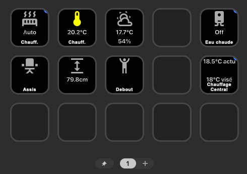

+++
date = '2025-04-13T15:57:00+02:00'
draft = false
title = 'Boutons'
categories = ['Domotique']
description = "Comment obentir des boutons permettant d'effectuer des actions sur Homeassistant."

[[variables]]
name = "homeassisant_domain"
label = "Lien de votre instance HomeAssistant"
default = "homeassisant.example.com"
validation = "text"
+++

J'ai longtemps cherché une solution pour ajouter des boutons physiques permettant d'actionner certains appareils
domotiques.

Il existe une pléthore de solutions ZigBee ou ZWave, mais il s'agit souvent de boutons à piles.
Je préférerais me passer d'un hub et contrôller directement mes boutons en WiFi.

Une des seules solutions généralement recommandée sur internet est le Shelly Button.





Malheureusement, il n'est plus vendu... Et même quand il l'était, il est cher, et ne supporte pas bien les coupures de
WiFI.
Il faut régulièrement le reconnecter au "hub".

Je suis donc parti à la recherche d'une autre solution.

# Mes solutions

Pour vous aider dans la mise en place de votre solution, vous pouvez remplir le formulaire suivant, qui personnalisera en partie
les instructions dans les tutoriels ci-dessous.




En fait, il n'existe pas de solution parfaite... Mais on peut vraiment s'en approcher.

J'avais besoin d'un contrôlleur pour mon bureau et un pour ma cuisine. Celui de mon bureau s'appuie sur mon ordinateur (
et donc sera en veille/éteint si celui-ci n'est pas branché).
Celui de la cuisine est entièrement autonome, et fonctionne à la fois sur secteur et sur batterie.




**Bureau** : Un StreamDeck

{}

- Très facile d'utilisation
- Pas de programmation requise
- L'ordinateur est connecté à internet et à homeassistant, pas le StreamDeck.
- Pas de contrôle sur la domotique si vous n'êtes pas connectés sur l'ordinateur (visiteurs, cambrioleurs, enfants...)

{}




**Cuisine** : M5Stack Core

{}

- Fonctionne sans être connecté directement à un ordinateur
- Fonctionne sur batterie en cas de coupure de courant
- Se connecte en WiFi directement à homeassistant
- Mise à jour à distance
- Peur servir de point de connexion de capteurs Bluetooth, Groove, ou GPIO
- Contrôle total sur son fonctionnement, nécessite un peu de programmation (ChatGPT peut vous aider)
  {}
  
  

## Bureau : Le StreamDeck

> [!IMPORTANT] En bref
> Le StreamDeck est un système préconçu qui ne nécessite pas de programmation, et dispose d'une interface élégante par défaut. 
> Il requiert cependant un ordinateur pour fonctionner, et ne peut pas être utilisé de manière autonome.
> Il est idéal placé dans votre bureau, connecté à votre ordinateur ou un Raspberry Pi.
> 
> Sa mise en place vous coutera environ 170 € (prix d'un StreamDeck MK2), plus le prix d'un Raspberry Pi si vous le souhaitez.
> Il est cependant possible de trouver moins cher (~60€), avec un StreamDeck plus petit (2 rangées de 3 boutons)
> 
> Si vous cherchez un système autonome, vous pouvez vous tourner vers le M5Stack Core, qui est plus complexe à mettre en place mais offre une flexibilité et une autonomie supérieures.
> Un tutoriel de mise en place du M5Stack Core sont disponibles dans la section cuisine :)


Pour contrôller facilement mes appareils domotiques dans mon bureau, je me suis appuyé sur un Stream Deck. 
J'ai choisi le grand modèle, mais vous pouvez utilisé n'importe quel modèle disponible sur leur site.






Une fois connecté sur un port USB libre de votre ordinateur, vous pouvez installer l'application StreamDeck.
Elle vous permet de contrôller certaines de vos applications, telles que Discord, OBS, Zoom, spotify, etc. 

Il existe cependant un marketplace qui permet l'installation de plugins supplémentaires. 
Dans notre cas, le [plugin HomeAssistant](https://marketplace.elgato.com/product/home-assistant-884c8c3e-8477-4ecb-99e0-f3101bbfa0aa)
s'installe après le simple clic sur le bouton "Open in Stream Deck".

Il ne vous reste plus qu'à ajouter un bouton "Home Assistant - Entity (Generic)" sur votre StreamDeck, et de le configurer.
Vous aurez pour cela besoin d'un [long-lived access token](https://developers.home-assistant.io/docs/auth_api/#long-lived-access-token),
token d'accès qui permet au plugin steamdeck de se connecter à votre instance HomeAssistant, et de changer l'état de vos appareils.

La création de ce token se fait simplement depuis votre interface HomeAssistant : 

{}

1. Allez dans votre interface HomeAssistant
2. Cliquez sur votre nom d'utilisateur en bas à gauche
3. Cliquez sur "Sécurité" dans la barre d'onglets en haut (Juste à côté de Général)
4. Scrollez jusqu'à "Jetons d'accès longue durée"
5. Cliquez sur "Créer un jeton"
6. Donnez un nom au jeton (ex: StreamDeck)
7. Copiez le token généré, et collez le dans le champ "Access-Token" de votre bouton StreamDeck
8. Profitez en pour remplir le Server URL : 
   wss://:8123/api/websocket
{}

Charge à vous de configurer les actions que vous souhaitez sur votre StreamDeck, et d'afficher les valeurs qui vous intèressent.

À titre indicatif, voici comment j'ai configuré le mien :



- Un appui sur le bouton "Chauff." actionne une automatisation qui allume le chauffage électrique du bureau.
- Un appui sur le bouton "Eau chaude" actionne une automatisation qui allume la chaudière pour 45 minutes.
- Un appui sur le bouton "Chauffage Central" augmente d'un degré la température demandée au thermostat de la chaudière.
- Les boutons assis et debout permettent de changer la position de mon bureau debout/assis.
- Les autres données (Températures, météo, humidité) sont affichées en temps réel sur le StreamDeck. Un appui ne fait rien.

## Cuisine : M5Stack Core

> [!IMPORTANT] En bref
> Le M5Stack Core est un système autonome qui fonctionne sur batterie et peut être utilisé sans connexion directe à un ordinateur.
> Il est idéal pour une utilisation dans la cuisine, ou il peut être placé à proximité d'une prise de courant
> Moins cher et moins encombrant que le StreamDeck, il est cependant plus complexe à mettre en place.
> 
> Pas de panique, je vous explique tout dans le tutoriel ci-dessous.

Tout comme pour le StreamDeck, il va falloir passer à la caisse pour acheter un peu de materiel





Bonne nouvelle, le M5Stack contenant un ESP32, il est compatible avec ESPHome.
Il vous suffit d'installer ESPHome sur votre instance HomeAssistant (si ce n'est pas déjà fait), puis d'y connecter votre M5Stack.

{}

1. Allez dans votre interface ESPHome (normalement, https://:6052) avec le navigateur Chrome (requis pour WebSerial)
2. En bas à droite, cliquez sur "Add Device"
3. Connectez votre M5Stack à votre ordinateur via un câble USB-C, si ce n'est pas déjà fait
4. Cliquez sur "Connect" dans la fenêtre qui s'ouvre
5. Sélectionnez le port de votre M5Stack (il devrait s'appeler quelque chose comme /dev/ttyUSB0)
6. Suivez les étapes de l'assistant
7. Patientez les deux minutes avec la fenêtre chrome au premier plan et cet onglet sélectionné pour éviter les erreurs de connexion
8. Les mises à jour se feront sans fil, une fois le M5Stack connecté à votre réseau WiFi
{}

Une fois que cela vous est proposé, éditez la configuration de votre afficheur.

{}
Encore une fois, cela est la configuration que j'utilise pour mon afficheur, avec mes entitées. Vous pouvez/devez adapter cette configuration à vos besoins.

ChatGPT peut vous aider à le faire.

```yaml
substitutions:
  device: Afficheur Cuisine
  name: afficheur-cuisine
  reboot_timeout: 14d

esphome:
  name: afficheur-cuisine
  friendly_name: Afficheur Cuisine

esp32:
  board: esp32dev
  framework:
    type: arduino

packages:
  common: !include common/common.yaml # Fichier qui contient les dépendances communes à tous vos ESPHome. Si vous n'en avez pas, commentez cette ligne
  logger: !include common/logger.yaml # Fichier qui contient vos configurations de message de log. Si vous n'en avez pas, commentez cette ligne

# Gestion du courant
external_components:
  - source:
      type: git
      url: https://github.com/ssieb/custom_components
    components: [ip5306]

i2c:
  sda: 21
  scl: 22
  scan: True

ip5306:
  battery_level:
    name: ${device} Battery Percent
    id: battery_percent
  charger_connected:
    name: ${device} Charger Connected
    id: connected
  charge_full:
    name: ${device} Charge Full
    id: full

light:
  - platform: monochromatic # backlight (activation de l'écran)
    output: gpio_32_backlight_pwm
    name: ${device} Backlight
    id: backlight
    restore_mode: ALWAYS_ON

# Internal LEDS
output:
  - platform: ledc # backlight output
    pin: 32
    id: gpio_32_backlight_pwm

# Récupération de l'heure sur homeassisant
time:
  - platform: homeassistant
    id: home_time
    timezone: Europe/Paris

# Récupération des données de votre maison sur homeassistant
# Vous devez remplacer les IDs par ceux de votre instance
sensor:
  - platform: homeassistant
    id: indoor_temperature
    entity_id: sensor.thermometre_cuisine_temperature
    on_value: # Rafraichis l'afficheur si la valeur change
      - component.update: my_display

  - platform: homeassistant
    id: indoor_humidity
    entity_id: sensor.thermometre_cuisine_humidity
    on_value:
      - component.update: my_display

  - platform: homeassistant
    id: weather_temperature
    entity_id: weather.forecast_maison
    attribute: temperature
    on_value:
      - component.update: my_display

  - platform: homeassistant
    id: media_duration
    entity_id: media_player.cuisine
    attribute: media_duration
    on_value:
      - component.update: my_display

  - platform: homeassistant
    id: media_position
    entity_id: media_player.cuisine
    attribute: media_position
    on_value:
      - component.update: my_display

# D'autres données récupérées de homeassistant, cette fois au format texte. Encore une fois, vous pouvez changer les IDs, et/ou retirer ce qui ne vous intérésse pas
text_sensor:
  - platform: homeassistant
    id: media_title
    entity_id: media_player.cuisine
    attribute: media_title
    on_value:
      - component.update: my_display

  - platform: homeassistant
    id: media
    entity_id: media_player.cuisine
    on_value:
      - component.update: my_display

  - platform: homeassistant
    id: media_artist
    entity_id: media_player.cuisine
    attribute: media_artist
    on_value:
      - component.update: my_display

  - platform: homeassistant
    id: weather_condition
    entity_id: weather.forecast_maison
    on_value:
      - component.update: my_display

  - platform: homeassistant
    id: media_position_updated_at
    entity_id: media_player.cuisine
    attribute: media_position_updated_at
    on_value:
      - component.update: my_display

# Envoi et configuration des boutons
binary_sensor:
  - platform: gpio
    id: M5_BtnA
    pin:
      number: 39
      inverted: true
    on_click:
      - min_length: 50ms
        max_length: 500ms
        then:
          - script.execute: backlight_timeout_script
          - if: # On active l'écran s'il est éteint. S'il est allumé, on change l'état des lumières de la cuisine
              condition:
                light.is_off: backlight
              then:
                - light.turn_on: backlight
              else:
                - homeassistant.service:
                    service: light.toggle
                    data:
                      entity_id: light.lumieres_cuisine
          - component.update: my_display
      - min_length: 500ms
        max_length: 10s
        then:
          - script.execute: backlight_timeout_script
          - if: # Meme chose ici, mais pour le lecteur de musique, lors d'un appui long sur le bouton.
              condition:
                light.is_off: backlight
              then:
                - light.turn_on: backlight
              else:
                - homeassistant.service:
                    service: media_player.media_previous_track
                    data:
                      entity_id: media_player.cuisine
          - component.update: my_display

  - platform: gpio
    id: M5_BtnB
    pin:
      number: 38
      inverted: true
    on_press:
      then:
        - script.execute: backlight_timeout_script
        - if:
            condition:
              light.is_off: backlight
            then:
              - light.turn_on: backlight
            else:
              - homeassistant.service:
                  service: automation.trigger
                  data:
                    entity_id: automation.turbo_eau_chaude
        - component.update: my_display

  - platform: gpio
    id: M5_BtnC
    pin:
      number: 37
      inverted: true

    on_click:
      - min_length: 50ms
        max_length: 500ms
        then:
          - script.execute: backlight_timeout_script
          - if:
              condition:
                light.is_off: backlight
              then:
                - light.turn_on: backlight
              else:
                - homeassistant.service:
                    service: media_player.media_play_pause
                    data:
                      entity_id: media_player.cuisine
          - component.update: my_display
      - min_length: 500ms
        max_length: 10s
        then:
          - script.execute: backlight_timeout_script
          - if:
              condition:
                light.is_off: backlight
              then:
                - light.turn_on: backlight
              else:
                - homeassistant.service:
                    service: media_player.media_next_track
                    data:
                      entity_id: media_player.cuisine
          - component.update: my_display

  # Capteur de présence de la pièce : s'il détecte quelqu'un, on active l'écran
  - platform: homeassistant
    id: presence_sensor
    entity_id: binary_sensor.capteur_de_presence_cuisine_presence_sensor_1
    on_state:
      - component.update: my_display
      - if:
          condition:
            binary_sensor.is_on: presence_sensor
          then:
            - light.turn_on: backlight
      - script.execute: backlight_timeout_script

  # Informations sur l'état de la chaudière (qui fournit l'eau chaude)
  - platform: homeassistant
    id: eau_chaude
    entity_id: switch.prise_chaudiere_switch_1
    on_state:
      - component.update: my_display

  # Informations sur l'état des lumières de la cuisine
  - platform: homeassistant
    id: lights
    entity_id: light.lumieres_cuisine
    on_state:
      - component.update: my_display


# Quand l'ESP a démarré et que l'on est connectés à HomeAssiant, on récupère l'état du capteur de présence, pour activer ou désactiver l'écran
api:
  on_client_connected:
    then:
      - delay: 10s
      - if:
          condition:
            binary_sensor.is_off: presence_sensor
          then:
            - light.turn_off: backlight
          else:
            - light.turn_on: backlight

# Configuration de l'affichage
spi:
  clk_pin: 18
  mosi_pin: 23
  miso_pin: 19

# Choix des polices. Ici, on dispose des icônes, et de deux tailles de la police Roboto
font:
  - file: "gfonts://Roboto"
    id: roboto
    size: 20
    glyphsets: [GF_Latin_Core] # Alphabet standard et lettres accentuées. Signes de ponctuation…,

  - file: "gfonts://Roboto"
    id: roboto_small
    size: 14
    glyphsets: [GF_Latin_Core]

  - file: "https://cdn.jsdelivr.net/npm/@mdi/font@7.4.47/fonts/materialdesignicons-webfont.ttf" 
    # Cette police contient des icônes, et prend beaucoup de place. On ne récupère que les icônes qui nous intéressent.
    id: weather_icons
    size: 50
    glyphs:
      - "\U000F0599"  # Sunny
      - "\U000F0590"  # Cloudy
      - "\U000F0597"  # Rainy
      - "\U000F0596"  # Pouring
      - "\U000F0595"  # Partlycloudy
      - "\U000F0591"  # Fog
      - "\U000F059E"  # windy
      - "\U000F0593"  # lightning
      - "\U000F067E"  # weather-lightning-rainy

display:
  - platform: ili9xxx
    model: M5STACK
    color_palette: 8BIT # 16 couleurs, pas assez de RAM pour plus :(
    cs_pin: 14
    dc_pin: 27
    reset_pin: 33
    id: my_display
    invert_colors: true
    rotation: 0
    update_interval: 600s
    # Définition des pages de l'afficheur
    pages:
      - id: media_page
        lambda: |-
          auto white = Color(255, 255, 255);
          auto green = Color(0, 255, 0);
          auto magenta = Color(255, 0, 255);
          auto gray = Color(160, 160, 160);

          id(draw_top_bar).execute();

          it.print(160, 28, id(roboto), magenta, TextAlign::TOP_CENTER, "Lecture en cours");

          if (!id(media_title).state.empty()) {
            it.print(160, 58, id(roboto), white, TextAlign::TOP_CENTER, id(media_title).state.c_str());
          } else {
            it.print(160, 58, id(roboto), gray, TextAlign::TOP_CENTER, "Pas de musique");
          }

          if (!id(media_artist).state.empty()) {
            it.print(160, 80, id(roboto_small), green, TextAlign::TOP_CENTER, id(media_artist).state.c_str());
          }

          if (!isnan(id(media_duration).state) && !isnan(id(media_position).state) && !id(media_position_updated_at).state.empty()) {
            float duration = id(media_duration).state;
            float base_position = id(media_position).state;
            float current_position = base_position;

            // Parse timestamp: "2025-04-12T23:46:04.770044+00:00"
            std::string ts = id(media_position_updated_at).state;
            int year, month, day, hour, minute, second;

            if (sscanf(ts.c_str(), "%d-%d-%d %d:%d:%d", &year, &month, &day, &hour, &minute, &second) == 6) {
              ESP_LOGD("media", "Parsed timestamp: %s", ts.c_str());
              ESP_LOGD("media", "Parsed as: %04d-%02d-%02d %02d:%02d:%02d", year, month, day, hour, minute, second);

              struct tm updated_tm = {};
              updated_tm.tm_year = year - 1900;
              updated_tm.tm_mon = month - 1;
              updated_tm.tm_mday = day;
              updated_tm.tm_hour = hour;
              updated_tm.tm_min = minute;
              updated_tm.tm_sec = second;
              updated_tm.tm_isdst = 0;

              time_t local_now = id(home_time).now().timestamp;
              struct tm *local_tm = localtime(&local_now);
              struct tm utc_tm = *local_tm;
              time_t local_offset = mktime(&utc_tm) - mktime(gmtime(&local_now));

              time_t updated_time = mktime(&updated_tm) + local_offset;
              time_t now_time = id(home_time).now().timestamp;

              ESP_LOGD("media", "Current local time: %ld", now_time);
              ESP_LOGD("media", "Updated time UTC converted: %ld", updated_time);

              float delta = difftime(now_time, updated_time);
              ESP_LOGD("media", "Delta seconds: %.1f", delta);

              if (delta > 0) {
                current_position += delta;
                if (current_position > duration) current_position = duration;
                ESP_LOGD("media", "Adjusted position: %.1f / %.1f", current_position, duration);
              } else {
                ESP_LOGD("media", "No delta or negative delta, not adjusting position.");
              }
            } else {
              ESP_LOGD("media", "Failed to parse timestamp: %s", ts.c_str());
            }


            float ratio = current_position / duration;
            if (ratio > 1.0f) ratio = 1.0f;

            // Draw progress bar
            int bar_width = 280;
            int bar_x = 20;
            int bar_y = 110;
            int progress_width = int(ratio * bar_width);

            it.filled_rectangle(bar_x, bar_y, bar_width, 8, Color(64, 64, 64));  // background
            it.filled_rectangle(bar_x, bar_y, progress_width, 8, white);         // progress

            // Draw timecode
            int dur_min = int(duration) / 60;
            int dur_sec = int(duration) % 60;
            int pos_min = int(current_position) / 60;
            int pos_sec = int(current_position) % 60;

            char time_buf[32];
            snprintf(time_buf, sizeof(time_buf), "%02d:%02d / %02d:%02d", pos_min, pos_sec, dur_min, dur_sec);
            it.print(160, bar_y + 12, id(roboto_small), white, TextAlign::TOP_CENTER, time_buf);
          }

          id(draw_bottom_bar).execute();

      - id: weather_page
        lambda: |-
          auto white = Color(255, 255, 255);
          auto blue = Color(0, 200, 255);

          id(draw_top_bar).execute();

          it.print(160, 20, id(roboto), blue, TextAlign::TOP_CENTER, "Météo");
          it.printf(160, 60, id(roboto), white, TextAlign::TOP_CENTER, "Ext: %.1f°C", id(weather_temperature).state);
          it.printf(160, 90, id(roboto), white, TextAlign::TOP_CENTER, "Int: %.1f°C, %.1f%%", id(indoor_temperature).state, id(indoor_humidity).state);
          // --- Icône météo ---
          std::string condition = id(weather_condition).state;
          if (condition == "sunny") {
            it.print(160, 130, id(weather_icons), white, TextAlign::TOP_CENTER, "\U000F0599");
          } else if (condition == "cloudy") {
            it.print(160, 130, id(weather_icons), white, TextAlign::TOP_CENTER, "\U000F0590");
          } else if (condition == "rainy") {
            it.print(160, 130, id(weather_icons), white, TextAlign::TOP_CENTER, "\U000F0597");
          } else if (condition == "pouring") {
            it.print(160, 130, id(weather_icons), white, TextAlign::TOP_CENTER, "\U000F0596");
          } else if (condition == "partlycloudy") {
            it.print(160, 130, id(weather_icons), white, TextAlign::TOP_CENTER, "\U000F0595");
          } else if (condition == "fog") {
            it.print(160, 130, id(weather_icons), white, TextAlign::TOP_CENTER, "\U000F0591");
          } else if (condition == "snowy") {
            it.print(160, 130, id(weather_icons), white, TextAlign::TOP_CENTER, "\U000F0598");
          } else if (condition == "windy") {
            it.print(160, 130, id(weather_icons), white, TextAlign::TOP_CENTER, "\U000F059E");
          } else if (condition == "lightning") {
            it.print(160, 130, id(weather_icons), white, TextAlign::TOP_CENTER, "\U000F0593");
          } else if (condition == "lightning-rainy") {
            it.print(160, 130, id(weather_icons), white, TextAlign::TOP_CENTER, "\U000F067E");
          } else {
            // Condition inconnue : afficher le texte
            it.print(160, 130, id(roboto), white, TextAlign::TOP_CENTER, condition.c_str());
          }

          // Add more conditions as needed
          id(draw_bottom_bar).execute();


script:
  # Affichages communs aux différentes pages.
  - id: draw_top_bar
    then:
      - lambda: |-
          auto bar_color = Color(64, 64, 64);
          auto text_color = Color(240, 240, 240);
          auto* it = id(my_display);

          // Barre du haut
          it->filled_rectangle(0, 0, 320, 20, bar_color);

          // Présence tout en haut
          Color presence_color = id(presence_sensor).state ? Color(0, 255, 0) : Color(255, 0, 0);
          it->filled_rectangle(250, 3, 14, 14, presence_color);

          // Batterie à gauche
          it->printf(5, 0, id(roboto_small), text_color, "Bat: %.0f%%", id(battery_percent).state);

          // Date au milieu (jj/mm)
          it->strftime(160, 0, id(roboto_small), text_color, TextAlign::TOP_CENTER, "%d/%m", id(home_time).now());

          // Heure à droite
          it->strftime(310, 0, id(roboto_small), text_color, TextAlign::TOP_RIGHT, "%H:%M", id(home_time).now());


  - id: draw_bottom_bar
    then:
      - lambda: |-
          auto bar_color = Color(64, 64, 64);
          auto* it = id(my_display);

          auto lights_on = id(lights).state;
          auto water_active = id(eau_chaude).state;
          auto music_playing = id(media).state == "playing";

          std::string txt_lights = lights_on ? "Lumières (on)" : "Lumières (off)";
          std::string txt_water = water_active ? "Chauff (on)" : "Chauff (off)";
          std::string txt_music = music_playing ? "Pause" : "Play";

          auto color_lights = lights_on ? Color(0, 255, 0) : Color(255, 0, 0);
          auto color_water = water_active ? Color(0, 255, 0) : Color(255, 0, 0);
          auto color_music = music_playing ? Color(0, 255, 0) : Color(255, 0, 0);

          it->filled_rectangle(0, 220, 320, 20, bar_color);

          it->print(20, 225, id(roboto_small), color_lights, TextAlign::TOP_LEFT, txt_lights.c_str());
          it->print(120, 225, id(roboto_small), color_water, TextAlign::TOP_LEFT, txt_water.c_str());
          it->print(220, 225, id(roboto_small), color_music, TextAlign::TOP_LEFT, txt_music.c_str());


  - id: backlight_timeout_script
    mode: restart
    then:
      - delay: 30s
      - if:
          condition:
            binary_sensor.is_off: presence_sensor
          then:
            - light.turn_off: backlight

interval:
  # Changement de page toutes les 15 secondes
  - interval: 15s
    then:
      - display.page.show_next: my_display
      - component.update: my_display

  # Mise à jour de la barre de progression pour la musique toutes les secondes si la musique est en cours de lecture, et que l'on est sur la page correspondante
  - interval: 1s
    then:
      - if:
          condition:
            and:
              - display.is_displaying_page:
                  id: my_display
                  page_id: media_page
              - lambda: 'return id(media).state == "playing";'
          then:
            - component.update: my_display
```
{}

Voici quelques images de mon installation : 






